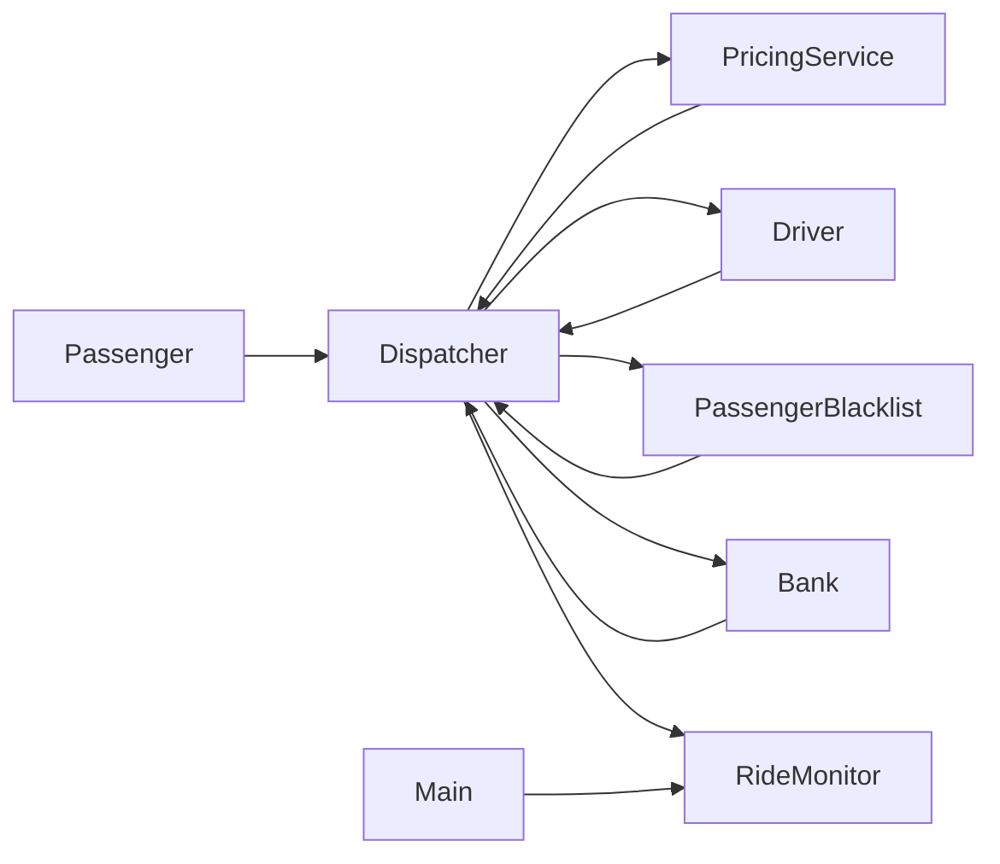
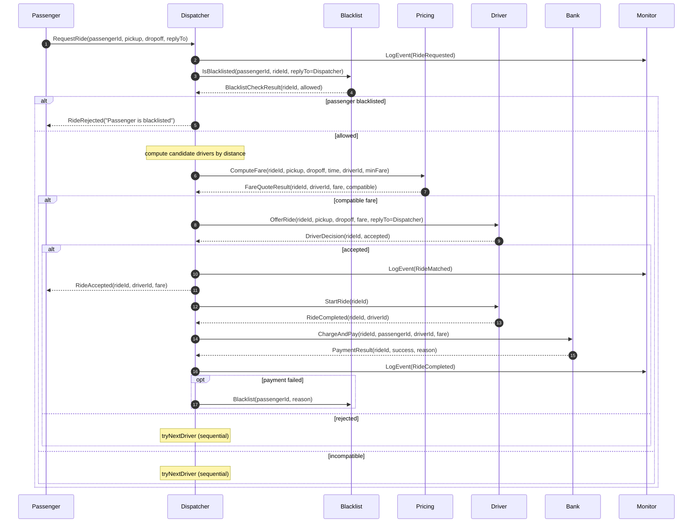
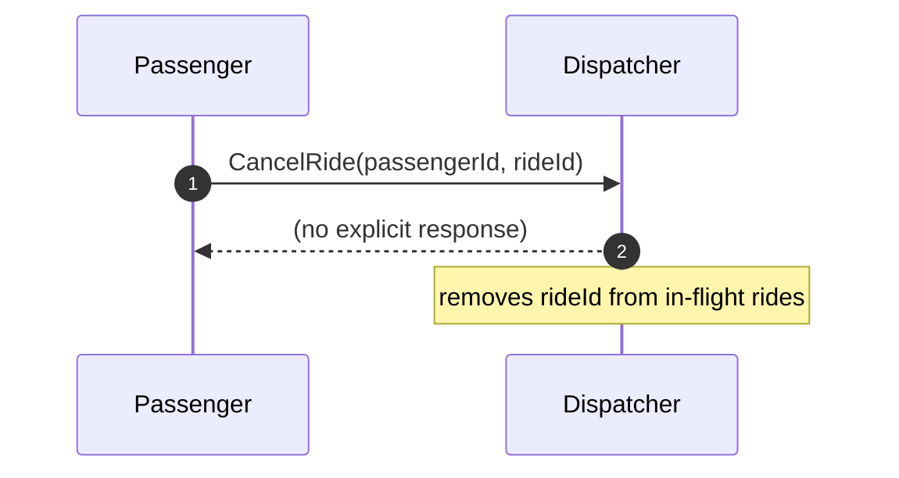
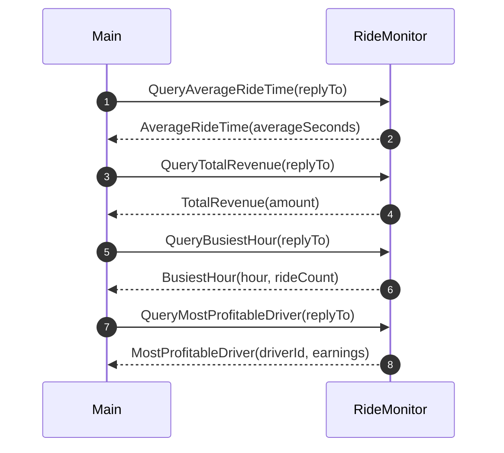

# Actor-Based Ride-Sharing Simulation — Architecture Report

## 1. Scope and goals
This project implements a simplified ride‑sharing simulation using **Akka Typed actors**. The primary goals are:

- Model a realistic, concurrent workflow (passengers request rides, drivers accept/complete rides).
- Keep the system **message-driven** and **actor-based**: each component owns its state and communicates via immutable messages.
- Provide **observability and analytics** (revenue, busiest hour, average ride time, top driver).
- Demonstrate multiple lecture patterns in a coherent design.

The system entry point is the actor system started in [src/main/scala/solutions/main.scala](src/main/scala/solutions/main.scala).

## 2. High-level architecture

### 2.1 Components
The system is composed of the following actor components:

- **Passenger actors**: periodically request rides and may cancel shortly after acceptance.
- **Driver actors**: register themselves, periodically update their location, decide whether to accept ride offers, and complete rides after a simulated travel time.
- **Dispatcher**: the orchestrator responsible for matching rides to drivers, coordinating blacklist checks, pricing, and payment.
- **PricingService**: computes fares based on distance and time-of-day (rush hour multiplier).
- **Bank**: maintains balances and executes charge + payout upon ride completion.
- **PassengerBlacklist**: rejects future ride requests for passengers who fail to pay.
- **RideMonitor (persistent)**: event-sourced log of ride events and an analytics aggregator rebuilt from events.

### 2.2 Component diagram (structure)

### 2.3 Message boundaries
All interactions happen through typed protocol messages defined in:
- [src/main/scala/solutions/protocol/Messages.scala](src/main/scala/solutions/protocol/Messages.scala)

Domain data types (coordinates, ride/driver metadata) are defined in:
- [src/main/scala/solutions/domain/Models.scala](src/main/scala/solutions/domain/Models.scala)

### 2.4 Key domain types and protocols (quick reference)
This section briefly summarizes the most important types used throughout the system.

**Domain models** ([src/main/scala/solutions/domain/Models.scala](src/main/scala/solutions/domain/Models.scala))
- `Coord`: 2D coordinate with a `distanceTo` helper used for proximity-based driver selection.
- `Availability`: driver availability flags (`OnlineAvailable`, `OnlineBusy`, `Offline`).
- `RideStatus`: ride lifecycle status values.
- `Ride`: immutable ride record (ids, pickup/dropoff, status, assigned driver, fare, timestamps).
- `DriverInfo`: runtime driver metadata (location, availability, minimum fare, earnings, ratings).
- `PassengerInfo`: passenger metadata.

**Typed protocols** ([src/main/scala/solutions/protocol/Messages.scala](src/main/scala/solutions/protocol/Messages.scala))
- `DispatcherProtocol`: main orchestration protocol (ride requests/cancellation/ETA, driver registration and updates, plus internal adapter replies).
- `DriverProtocol`: driver-facing commands (`OfferRide`, `StartRide`, `CancelRide`).
- `PricingProtocol`: fare computation request (`ComputeFare`).
- `BankProtocol`: payment execution request (`ChargeAndPay`).
- `BlacklistProtocol`: blacklist queries and updates.
- `MonitorProtocol`: event logging and analytics queries; defines the persistent `RideEvent` model.

## 3. Runtime behavior and message flows

### 3.1 Ride request → matching → completion → payment
The primary workflow is an end-to-end pipeline coordinated by the Dispatcher.

Key design points:
- The Dispatcher maintains **in-memory ride state** (per rideId) and **driver state** (location, availability, minFare).
- Driver selection is **distance-based** using `Coord.distanceTo`.
- The system is resilient to partial failures by keeping each step explicit and message-driven.

### 3.2 Cancellation
Passengers may cancel shortly after acceptance. Cancellation is intentionally minimal: the Dispatcher drops the ride state.

### 3.3 Analytics (querying the RideMonitor)
After startup (and a short wait), `Main` queries analytics via the **ask pattern**.

## 4. Actor-based architecture: responsibilities and state ownership

### 4.1 Passenger (actor)
- Owns passenger behavior (periodic ride requests, optional cancellation).
- Uses a small internal state machine implemented as two behaviors: `idle` and `inRide`.

### 4.2 Driver (actor)
- Owns driver availability, periodic location updates, and ride execution timing.
- Uses timers for:
  - periodic `LocationTick`
  - one-shot `FinishRide` to simulate travel time

### 4.3 Dispatcher (actor)
- Central coordinator for the workflow.
- Owns:
  - the set of drivers and their latest location/availability
  - the set of in-flight rides and their progression (candidates, selected driver, fare, start time)

### 4.4 PricingService, Bank, PassengerBlacklist (actors)
These are pure service actors with small, isolated responsibilities:
- PricingService: deterministic fare computation + compatibility check against driver minimum.
- Bank: balance checks and atomic balance updates.
- PassengerBlacklist: persistent-in-memory set of banned passengers.

### 4.5 RideMonitor (event-sourced actor)
- The authoritative **event log** for ride lifecycle events.
- Maintains analytics by replaying events into an aggregated State.

Persistence configuration is in [src/main/resources/application.conf](src/main/resources/application.conf) using an in-memory journal for this assignment.

## 5. Architectural patterns applied (3+)

### Pattern 1 — Forward Flow (Pipeline)
**Where:** the ride lifecycle is modeled as a forward-moving message flow:

`RequestRide → Blacklist check → Driver matching → Pricing → Offer/Decision → Start/Complete → Payment → Monitoring`

**Why it fits:**
- Each step is an explicit message exchange.
- The Dispatcher acts as the pipeline coordinator, keeping the state necessary to continue the flow.

**Design decisions enabled by this pattern:**
- Keep protocols typed and explicit (no shared mutable state).
- Make failure modes local to a step (e.g., “no compatible driver” or “payment failed”).

### Pattern 2 — Aggregator
**Where:** analytics are computed by aggregating multiple events:
- RideMonitor aggregates `RideCompleted` into totals (revenue, completed rides by hour, driver earnings, average ride time).

**Why it fits:**
- Analytics are derived information that should not be manually maintained across many actors.
- A single aggregator avoids duplication and keeps derived state consistent.

**Design decisions enabled by this pattern:**
- Provide a simple query interface (Query* commands) decoupled from the core workflow.
- Keep analytics updates idempotent and deterministic via event replay.

### Pattern 3 — Event Sourcing
**Where:** RideMonitor is implemented using `EventSourcedBehavior` and persists `RideEvent`.

**Why it fits:**
- Supports rebuilding analytics state by replaying events.
- Provides a clear audit trail of ride activity.

**Design decisions enabled by this pattern:**
- Separate writes (`LogEvent`) from reads (`Query*`) cleanly.
- Allow future extensions (e.g., rating computations) without rewriting core workflow state.

### (Additional) Pattern — Supervision / Restart strategy
**Where:** the Dispatcher is spawned under supervision with restart on failure.

**Why it fits:**
- Demonstrates resilience for the coordinating actor.
- Keeps the system alive even if the Dispatcher throws due to unexpected states.

## 6. Code quality and structure

### 6.1 Package structure
The code is intentionally structured by responsibility:
- `solutions.actors`: user-facing actors (Passenger, Driver)
- `solutions.services`: service and coordination actors (Dispatcher, Bank, PricingService, PassengerBlacklist, RideMonitor)
- `solutions.protocol`: all typed message protocols
- `solutions.domain`: immutable domain models

This structure keeps:
- message contracts stable and centralized
- domain types reusable
- actor logic isolated by role

### 6.2 Abstraction and maintainability choices
- **Typed protocols**: strong compile-time guarantees about messages.
- **Immutable state** in each actor: state transitions are explicit via `copy`.
- **Timers** for periodic behavior: avoids blocking and maintains responsiveness.
- **Ask pattern** only used for analytics querying in `Main` (read-only queries).

### 6.3 Documentation expectations
To meet the “thoroughly documented” requirement:
- Each major actor/service should have a short Scaladoc header describing its role and state.
- Protocol types should remain the single source of truth for message shapes.

## 7. Limitations and possible extensions
- Cancellation is minimal (no driver notification or refund logic).
- Dispatcher currently uses a sequential “try next driver” approach; a scatter-gather strategy could be added if desired.
- Persistence is configured as in-memory journal for simplicity.

## 8. How to run
See [README.md](README.md).
